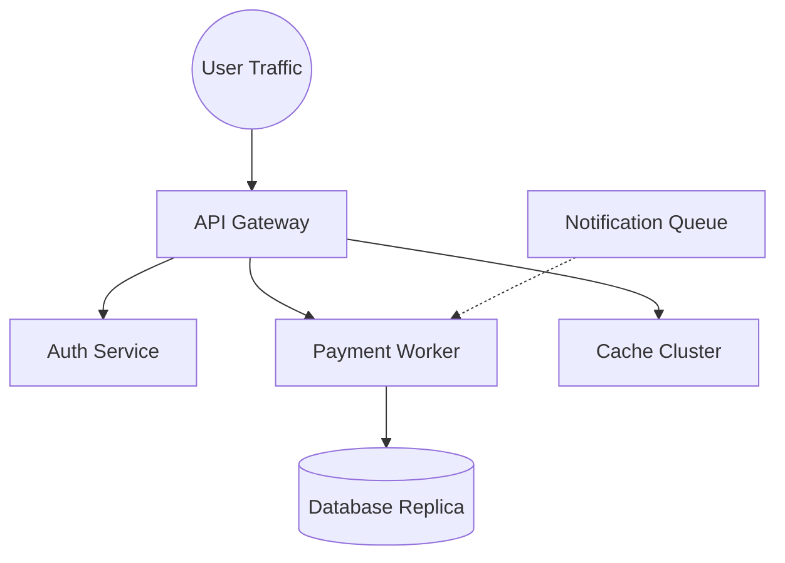

# 🛠️ TRIAGE-X: SRE Incident Response Benchmark
**"The first high-fidelity, deterministic SRE simulation environment for Autonomous AI Agents."**

[](https://github.com/openenv/spec)
[](https://huggingface.co/docs/hub/spaces-sdks-docker)
[](https://huggingface.co/spaces/mohit0011/triage-x)

---

## 🎯 Project Overview
**TRIAGE-X** is a production-grade incident response simulator designed for the **OpenEnv Reinforcement Learning Benchmark**. Unlike generic "toy" environments (games, math, or simple web navigation), TRIAGE-X models the high-stakes reality of **Site Reliability Engineering (SRE)**.

AI agents are placed in a live "NOC" where they must diagnose cascading microservice failures, manage a limited infrastructure budget, and restore system health without crashing healthy components.

### 🏗️ System Architecture (Simulated Topology)


---

## 🚀 Key Differentiators (Winner Features)

> [!IMPORTANT]
> **Real-World Utility (30% Weight):** Models authentic microservice failure patterns including **Backpressure Bottlenecks**, **Hidden Cascading Dependencies**, and **Alert Fatigue**.

*   **⚡ Deterministic Logic:** Every task variant (v1, v2, v3) is 100% deterministic, ensuring reproducible agent benchmarks across multiple runs.
*   **⚖️ Multi-Dimensional Grading:** Graders don't just check "Did it work?". They analyze **SLA Stability**, **Budget Utilization**, and **Action Efficiency**.
*   **📽️ Observability Dashboard:** Includes a minimalist React/Vite "War Room" dashboard for human verification of agent trajectories.
*   **📦 OpenEnv Spec Native:** Strictly implements `POST /reset`, `POST /step`, `GET /state`, `GET /tasks`, `GET /score`, and `GET /health`.
*   **🐍 Multi-Mode Compliance:** Fully compliant with Python-based OpenEnv validators using `pyproject.toml`, `uv.lock`, and a standard `server` entry point.

---

## 🧩 Benchmark Scenarios (Tasks)

The environment ships with 3 distinct grading difficulties producing a normalized final episode score between `0.0` and `1.0`:

| Task | Difficulty | Pattern Modeled |
| :--- | :--- | :--- |
| `easy_signal_noise` | 🟢 Easy | Queue bottlenecks & Horizontal Scaling. |
| `medium_hidden_dependency` | 🟡 Medium | Cascading failures & Latency propagation. |
| `hard_multi_incident` | 🔴 Hard | Concurrent cluster anomalies & Budget management. |

---

## ⚖️ Scoring & Reward Function
The `rewardEngine.js` provides granular trajectory signals (shaping) in the range of `[-1.0, 1.0]`. The final score is calculated using the following Meta-aligned weights:

| Dimension | Weight | Metric |
| :--- | :---: | :--- |
| **System Stability** | 30% | Final Avg. Health vs. SLA Target |
| **Harm Reduction** | 25% | Cumulative Customer Impact saved |
| **Root Cause Resolution** | 25% | Binary check for core issue fix |
| **Action Efficiency** | 10% | Steps used vs. Max allowed |
| **Budget Utilization** | 5% | Infrastructure cost management |
| **Safety Violation** | 5% | Penalty for "Reckless Rebooting" |

---

## 🎮 Action & Observation Space

### Observation Space (`GET /state`)
```json
{
  "system_health": 0.85,        // Normalized stability score
  "customer_impact": 12.5,        // Downstream severity (Lower is better)
  "remaining_budget": 1200,       // $ cost of cloud resources
  "services": [...],              // Component telemetry (Latency, Errors, Health)
  "active_alerts": [...]          // CloudWatch / Datadog simulants
}
```

### Action Space (`POST /step`)
Agents specify an `action` and a `target`:
- `inspect_service`: Reveal hidden internal telemetry.
- `inspect_dependency`: Trace downstream routing maps.
- `restart_service`: Hard cycle a component (High Cost).
- `throttle_queue`: Drop traffic to clear backpressure.
- `rollback_deploy`: Revert a faulty deployment signature.
- `scale_service`: Add horizontal instances to handle load.

---

## 🛠️ Setup & Local Execution

### Option A: Python / UV (Recommended for Validators)
The environment is compatible with `uv` and standard Python entry points:
```bash
# Install dependencies
uv sync

# Start the environment server (Wraps Node.js backend)
uv run server
```

### Option B: Native Node.js Backend
If you prefer running the core server directly:
```bash
cd server
npm install
npm start
```

### 2. Boot Observability Dashboard (Port 5173)
```bash
cd client
npm install
npm run dev
```

### 3. Agent Inference Logic
To run the benchmark against an LLM (Default: `gpt-4o-mini`):
```bash
# Set OPENAI_API_KEY in .env
python3 inference.py
```
*(Inference script emits strictly formatted logs: `[START]`, `[STEP]`, and `[END]` for evaluator scaling)*.

---

## 🐳 Container Deployment (HF Spaces)
Root contains a compliant `Dockerfile`. The space is configured as a `docker` SDK space but supports multi-mode interaction via the `server` entry point.
```bash
docker build -t triage-x .
docker run -p 7860:7860 triage-x
```

---
*Created for the Meta x Hugging Face Hackathon - TRIAGE-X Benchmark Environment.*
