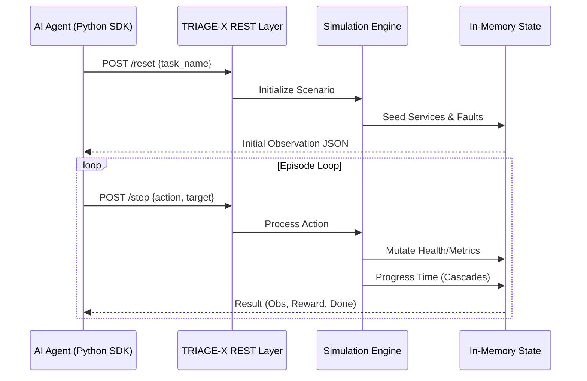

# 🏗️ TRIAGE-X System Architecture
**"Deterministic State Management for High-Fidelity AI Evaluation."**

TRIAGE-X is architected as a decoupled simulation engine that exposes a standardized REST interface. The core philosophy is to provide a "Black Box" environment where the agent's only window into the system is through noisy telemetry, mirroring real-world SRE conditions.

---

## 🛰️ High-Level System Flow
The interaction follows the classic RL loop (Observation -> Action -> Reward) but is strictly constrained by a RESTful state machine.

---

## 📦 Core Subsystems

### 1. The Simulation Engine (`/server/src/engine/`)
The heart of TRIAGE-X. It handles the discrete-time progression of the environment.
*   **Action Handler:** Maps agent intents (e.g., `restart_service`) to deterministic state mutations.
*   **Progression Engine:** Simulates "Entropy" and "Cascades". If a database is slow, the API Gateway latency naturally increases in the next tick.
*   **State Manager:** A strictly isolated, deep-cloned state store that ensures zero "leakage" between evaluation episodes.

### 2. Task & Scenario Loader
Scenarios are defined in JSON templates. Each scenario includes:
- **Topology:** The directed dependency graph of services.
- **Fault Injection:** Hidden variables that define the root cause (e.g., `memory_leak` or `unauthorized_traffic_spike`).
- **Telemetry Noise:** Configuration for how "noisy" the alerts should be for that specific difficulty.

### 3. Programmable Reward & Grader
*   **Reward Engine:** Calculates "Dense" rewards at every step to provide a strong gradient for learning agents. It penalizes wasted budget and rewards diagnostic steps.
*   **Final Grader:** A terminal evaluator that provides a normalized `[0.0 - 1.0]` score based on the final system stability and efficiency.

---

## 🛠️ Data Integrity & Determinism
To ensure **Reproducible Benchmarking**, TRIAGE-X adheres to these strict rules:
1. **No Global Randomness:** All "variations" are seeded at the task level (`variant_v1`, `variant_v2`).
2. **Immutability:** The state is never mutated in place; every `step()` produces a new state snapshot.
3. **Isolations:** Each `reset()` completely purges the memory, preventing cross-episode contaminants.

---
*TRIAGE-X Architecture Documentation - Meta x Hugging Face Hackathon*